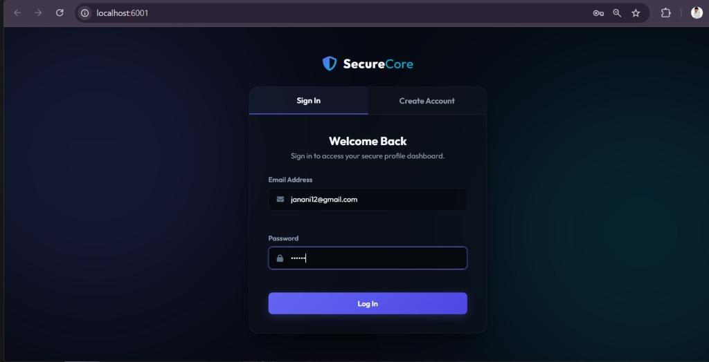
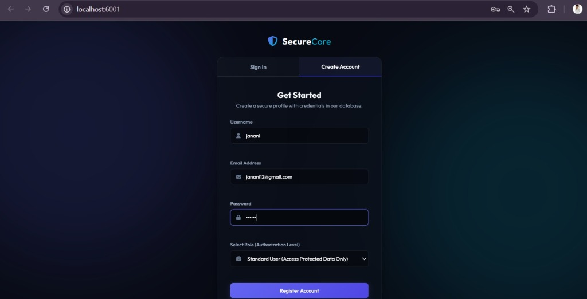
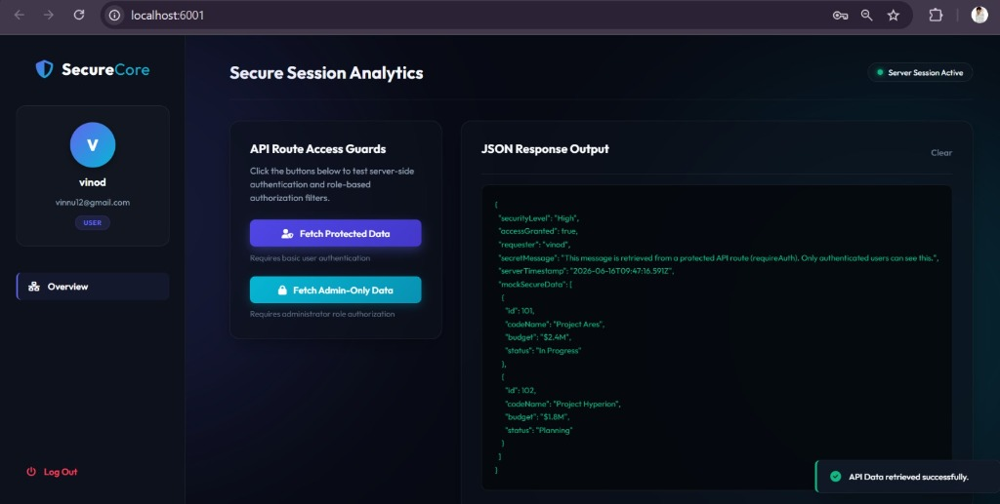
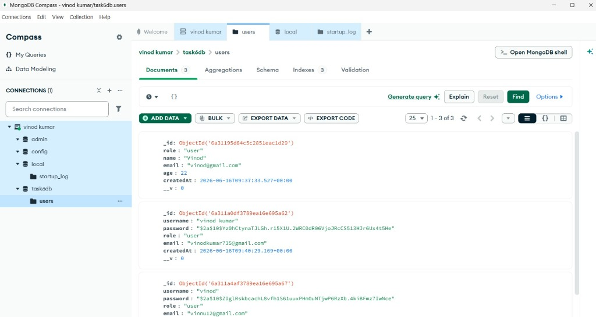

# Task 6: Database Integration & User Authentication

Welcome to the **Task 6: Database Integration & User Authentication** workspace, completed as part of the Cognifyz Full-Stack Developer Internship.

This project implements a secure, database-driven **User Registration and Authentication Portal** featuring Express backend middleware, MongoDB integration via Mongoose, secure password hashing using `bcryptjs`, and session management via `express-session` cookies.

---

## 📂 Folder Structure

```text
Task-6-Database-Integration-and-User-Authentication/
├── data/
│   └── users.json         # Local JSON database store (fallback)
├── models/
│   └── User.js            # User Schema model definition for MongoDB Mongoose
├── public/
│   ├── css/
│   │   └── style.css      # Custom styling, dark dashboard themes, glows, transitions
│   ├── js/
│   │   └── app.js         # Tab switching, form actions, async Fetch calls, response console
│   └── index.html         # Portal markup: signup/signin panels and security dashboard
├── screenshots/           # Screenshot captures of app authentication flows
│   ├── 01-signin-tab.jpg
│   ├── 02-signup-tab.jpg
│   ├── 03-dashboard-user.jpg
│   └── 04-mongodb-compass.jpg
├── .env                   # Configuration file (ports, MongoDB URI, session secret)
├── package.json           # Node configuration and dependencies script
├── server.js              # Express auth server and secure API endpoint guards
└── README.md              # Detailed project documentation
```

---

## 🔒 Security Architectures & Core Features

1. **MongoDB Database Model**: Connects dynamically using Mongoose. Defines validations on schema constraints (unique, required, lowercase, matching regex).
2. **Hybrid Offline Fallback**: Features a database fail-safe check. If MongoDB is not running locally, the backend gracefully falls back to a file-based JSON store (`data/users.json`) with the exact same security properties, preventing application crashes.
3. **Password Hashing**: Implements standard one-way salted hashing via `bcryptjs` (salt rounds: 10) on registration prior to database insertion.
4. **Session Authentication**: Integrates `express-session` to verify client states via signed session cookies (`connect.sid`), protecting APIs from anonymous requests.
5. **Role-Based Authorization (RBAC)**: Protects administrative routes by filtering requests against session roles (e.g. standard `user` vs. `admin`), returning `403 Forbidden` if validation filters fail.
6. **API Console Logger**: Includes a developer-friendly interactive panel on the dashboard that formats and logs JSON responses from secured backend endpoints in real-time.

---

## 🛠️ API Endpoints

The Express auth backend exposes the following endpoints:

| Method | Endpoint | Description | Access Level | Response Code |
| :--- | :--- | :--- | :--- | :--- |
| **POST** | `/api/auth/register` | Register a new user | Public | `201 Created` / `400 Bad Request` |
| **POST** | `/api/auth/login` | Log in and start session | Public | `200 OK` / `401 Unauthorized` |
| **POST** | `/api/auth/logout` | Terminate active session | Authenticated | `200 OK` / `500 Server Error` |
| **GET** | `/api/auth/me` | Fetch logged-in user profile | Authenticated | `200 OK` (JSON user details) |
| **GET** | `/api/data/protected` | Fetch protected user statistics | Authenticated (`requireAuth`) | `200 OK` / `401 Unauthorized` |
| **GET** | `/api/data/admin` | Fetch critical system metrics | Admin Only (`requireRole('admin')`) | `200 OK` / `403 Forbidden` |

---

## 💻 Running the Application Locally

### Prerequisites
Make sure you have [Node.js](https://nodejs.org/) installed.

### Setup Instructions
1. Navigate into the Task 6 directory:
   ```bash
   cd Task-6-Database-Integration-and-User-Authentication
   ```
2. Install dependencies:
   ```bash
   npm install
   ```
3. Configure your environment variables inside `.env`:
   * Set `PORT=6001` (avoids Chromium unsafe port warnings on 6000).
   * Set your `MONGODB_URI` (defaults to a local MongoDB instance `mongodb://127.0.0.1:27017/cognifyz_task6`).
4. Start the application:
   ```bash
   npm start
   ```
5. Open your web browser and navigate to: **[http://localhost:6001](http://localhost:6001)**

---

## 📸 Screenshots

Captured and saved inside the `screenshots/` directory:

### 1. Sign In Portal (`01-signin-tab.jpg`)
The primary authentication login form built with ambient styling and input error fields.


### 2. Create Account Portal (`02-signup-tab.jpg`)
The registration panel that lets you choose a role (Standard User vs. Administrator) to test role-based access.


### 3. User Dashboard & Protected API (`03-dashboard-user.jpg`)
Shows the dashboard after logging in as a standard user. Displays user details, access roles, and a code block rendering data retrieved from `/api/data/protected`.


### 4. MongoDB Database Storage (`04-mongodb-compass.jpg`)
Shows the local MongoDB database connection and active storage of user collection data in `task6db.users`.

