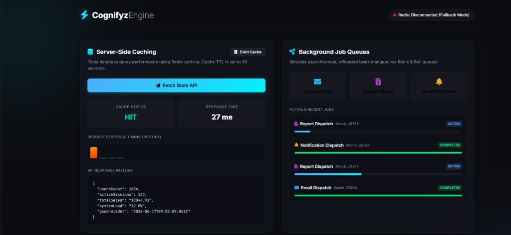
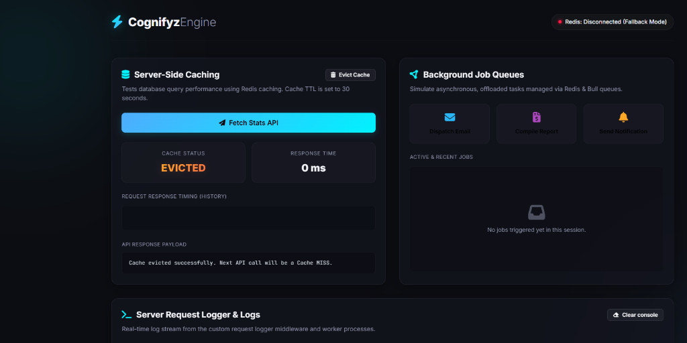
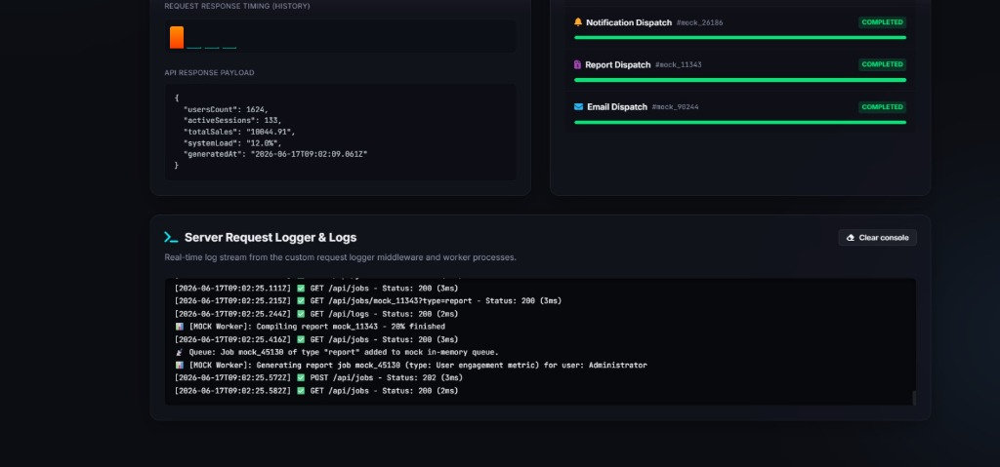

# Cognifyz Engine - Interactive Verification Screenshots

This document contains screenshots showing the successful manual testing and verification of the **Cognifyz Engine** dashboard (advanced caching and job queues).

---

### 1. Caching & Job Queue Panel
The caching panel shows a successful **Cache HIT** (resolving in `27ms`) alongside multiple completed and active background jobs (email, report, and notification dispatches):

---

### 2. Cache Eviction Action
Evicting the cache successfully, resetting the state so that the next API call triggers a fresh query (Cache MISS):

---

### 3. Real-Time Server Logs Console
The logger console showing live progress updates from worker compiles (e.g. `Compiling report mock_11343 - 20% finished`) and incoming API request status codes logged by the logging middleware:

